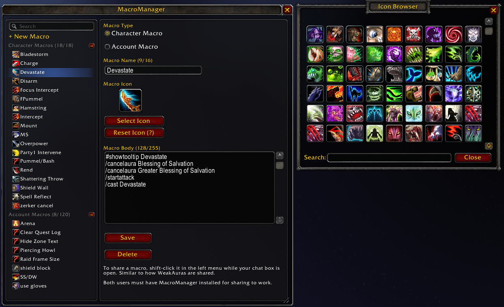

# MacroManager addon
Tested on Classic WOTLK but should work on retail.

Type `/mm` or `/macromanager` to open the UI.

Built by `Grrumpy <Coldblooded> - Faerlina (US)`

### Features
- Uses the built-in macro system and your existing macros.
- Clean and streamlined UI.
- Easily move macros between account and character specific.
- Share macros in chat like you share WeakAuras.

### Special thanks to
- The kind folks at [WoWUIDev Discord](https://discord.gg/h7WSRf8) for helping me as I build my first addon.
- [AceGUI](https://www.wowace.com/projects/ace3/pages/ace-gui-3-0-tutorial) for a great UI library.
- [WeakAuras](https://wago.io/weakauras) for the sharing code.
- [LibAdvancedIconSelector](https://www.curseforge.com/wow/addons/libadvancediconselector-1-0) for building a great icon picker.
- [LargerMacroIconSelection](https://www.curseforge.com/wow/addons/larger-macro-icon-selection) for fixing the great icon picker to work with the latest APIs.
